# tugasrdm-indexingtool

>>Image-search-engine(Image Indexing)

1. pertama istall git dahulu dengan syntax “sudo apt install git”
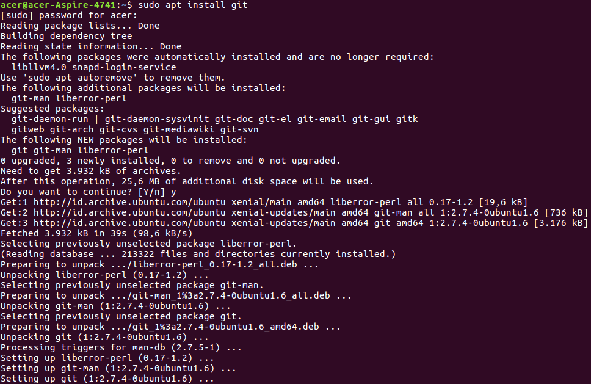

2. Clone dahulu dengan syntax : git clone https://github.com/kudeh/image-search-engine.git
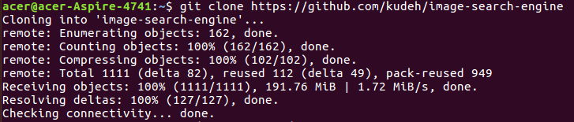

3.Lakukan Update. Syntax : sudo apt-get update
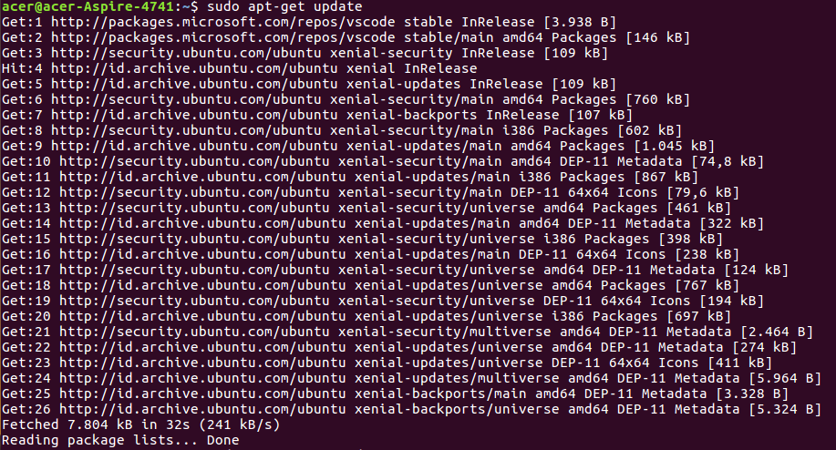

4. Lakukan Upgrade. Syntax : sudo apt-get upgrade
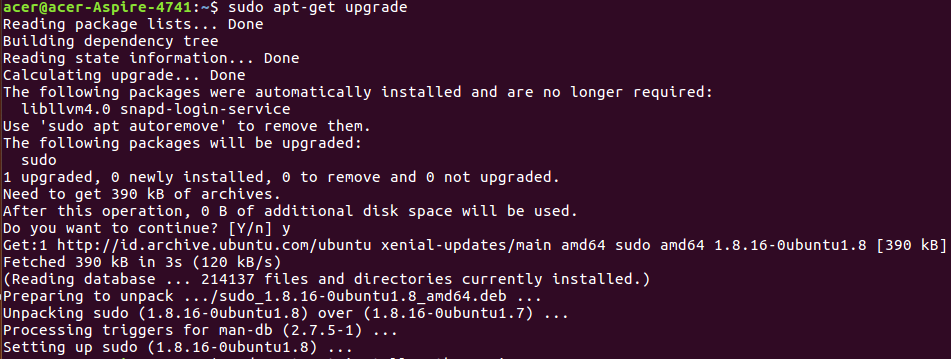

5. lalu install python3 dengan syntax :
sudo apt-get install python3-pip
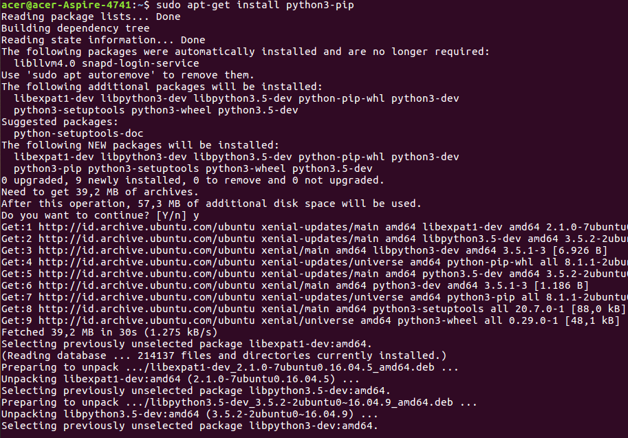

6.Mulai tahapan untuk menjalankan program. Syntax : 
cd image-search-engine/ lalu pip3 install -r requirements.txt untuk menginstall modul Python 
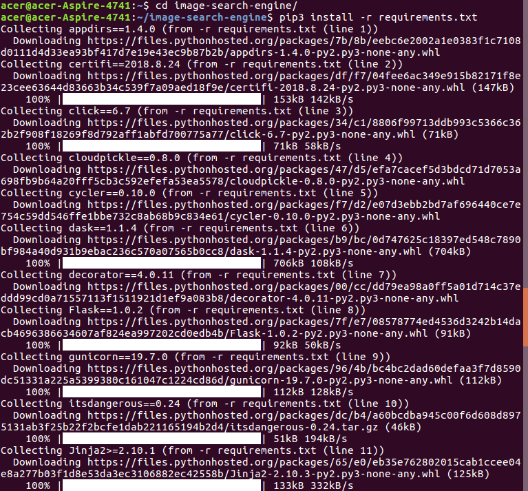

7. ketik cd app selanjutnya jalankan program dengan syntax : python3 index.py --dataset static/images --index index.csv
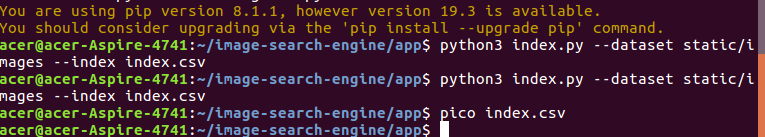

8. cek hasil dengan menggunakan syntax pico index.csv
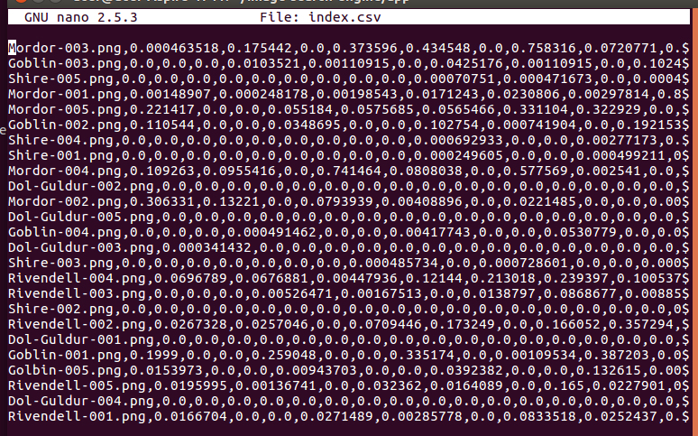

9. Buka ./static/images untuk mengubah image anda

>> Swish-e (Text Indexing)

1. Install Swish-e. Syntax : sudo apt-get install swish-e
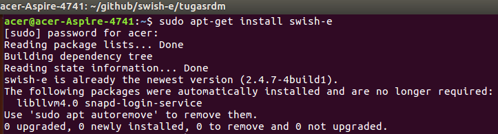

2. Modifikasi data dengan beberapa sintax, seperti yang terdapat pada screenshot
Masukkan syntax IndexDir ./data dalam tugas.conf
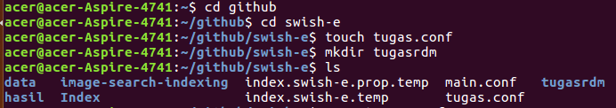

Masukkan isi dalam file.txt seperti beberapa kata
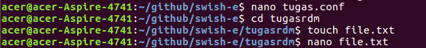

3. untuk menjalankan program text indexing, gunakan syntax : swish-e -c tugas.conf
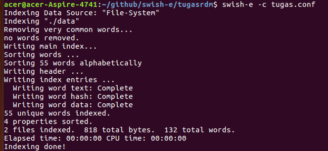

4. untuk menjalankan program dengan mencari salah satu kata, gunakan syntax : swish-e -w (misal kata : aku)
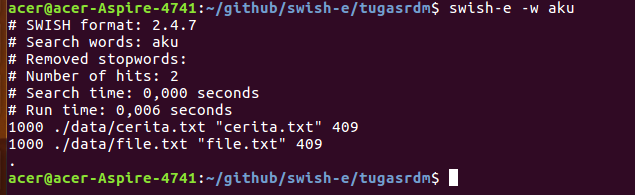
